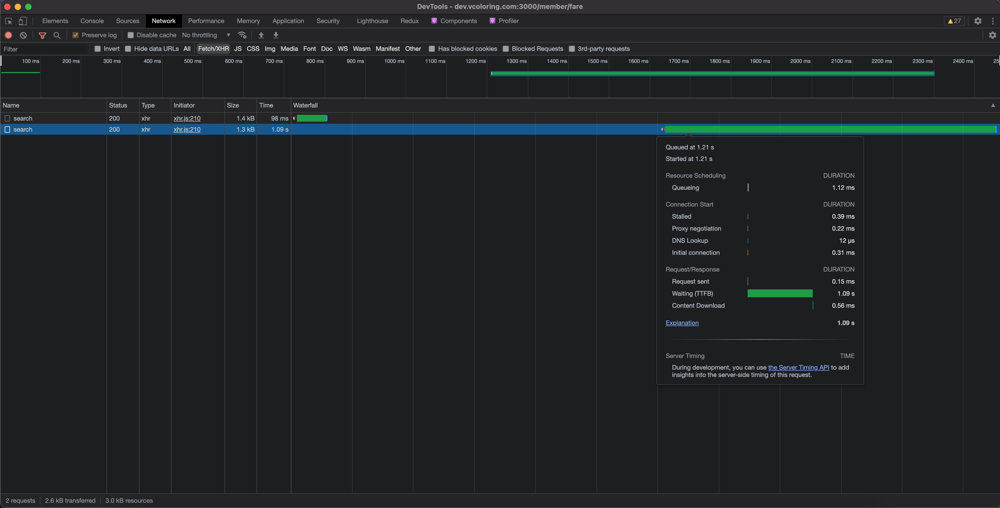

# Browser

### TTFB (Time To First Byte)

HTTP 요청을 했을 때, 첫번째 byte가 브라우저에 도달하는 시간

### Safe Area

TV에서 처음 도입된 개념으로 TV 해상도 비율이 다양해지면서 영상에서 타이틀, 자막 등이 필수 콘텐츠의 노출을 보장할 수 있는 영역이다. 아이폰에도 안정적으로 콘텐츠를 제공할 수 있는 Safe Area가 필요하게 되었다.
(참고) [!iOS 11의 WebView 뷰포트 이해하기](https://ayogo.com/blog/ios11-viewport/)

### BFCache

사용자가 다른 곳으로 이동할 때 페이지 전체 스냅샷(JS 힙 포함)을 저장하는 메모리 내 캐시이다. 전체 페이지를 메모리에 저장하면 브라우저가 빠르고 쉽게 페이지를 복원할 수 있다.

#### 장점

1. 네트워크에 연결하지 않고도 전체 페이지를 메모리에서 복원할 수 있다.
2. BFCache는 탐색 속도를 높일 뿐만 아니라 리소스를 다시 다운로드 할 필요가 없기 때문에 데이터 사용량도 줄일 수 있다.

(참고) [!BFCache](https://web.dev/bfcache)
